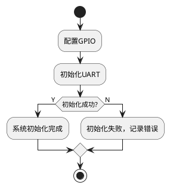

# ncdocgen - C文档生成器

[](docs/CHANGELOG.md)
[](https://www.python.org/)
[](LICENSE)

> **📌 项目声明**：本项目基于 [Gitee: kzhuo/ncdocgen](https://gitee.com/kzhuo/ncdocgen) 进行改进和扩展。
> 
> 原作者：Kaikuo Zhuo <kaikuo.zhuo@hotmail.com>  
> 当前维护者：Kuan He <hekuan_oscar@qq.com>

## 简介

ncdocgen 是一个功能强大的C语言文档自动生成工具，可以根据代码中的 **doxygen风格注释**，自动生成 **详细设计文档** 和 **PlantUML流程图**。

### 与原项目的区别

本版本在原作者 Kaikuo Zhuo 的基础上进行了以下改进：

- ✅ 添加图形化界面（GUI）
- ✅ 添加自动 Key.txt 生成功能（基于 ctags）
- ✅ 改进中文字符串支持
- ✅ 添加详细的代码注释
- ✅ 优化命令行参数处理
- ✅ 改进错误处理和日志记录

### 主要特性

- 📄 **自动文档生成**: 从源代码提取注释，生成函数说明表
- 📊 **流程图绘制**: 自动分析代码逻辑，生成PlantUML流程图
- 🎨 **GUI界面**: 友好的图形界面，无需命令行知识
- 🔧 **命令行支持**: 支持命令行模式，便于脚本集成
- 📝 **Markdown输出**: 标准Markdown格式，易于发布和转换
- 🔑 **智能关键字**: 自动提取项目关键字，准确解析代码

### 适用场景

- 嵌入式C项目详细设计文档编写
- 代码审查和文档同步维护
- 项目交接和代码理解
- 自动化文档流水线

## 快速开始

### 安装

1. 从 [Releases](../../releases) 页面下载 `ncdocgen.exe`
2. 将文件复制到任意目录（建议放在项目目录下）
3. 双击运行即可，无需安装

> **系统要求**: Windows 10/11，512MB内存，100MB磁盘空间

### 基本使用

```
1. 双击启动 ncdocgen.exe
2. 点击 "📂 输入文件" 选择要分析的C源文件
3. 选择 "📁 项目路径"（项目根目录）
4. 点击 "➕生成Key" 扫描项目关键字
5. 点击 "🚀 开始生成文档"
6. 查看生成的 output.md 文件
```

详细使用说明请参阅 [用户手册](docs/USER_GUIDE.md)。

## 文档索引

| 文档 | 说明 |
|------|------|
| [用户手册](docs/USER_GUIDE.md) | 面向最终用户的详细使用说明 |
| [架构设计](docs/ARCHITECTURE.md) | 系统架构和模块设计说明 |
| [开发文档](docs/DEVELOPMENT.md) | 面向开发者的开发和维护指南 |
| [发布指南](docs/RELEASE_GUIDE.md) | 如何打包和发布新版本 |
| [常见问题](docs/FAQ.md) | 常见问题解答 |
| [更新日志](docs/CHANGELOG.md) | 版本更新历史记录 |

## 功能展示

### 函数说明表

自动生成的函数说明表包含：
- 函数原型
- 功能概述
- 参数说明
- 返回值说明
- 引用关系
- 全局变量引用和修改

### 流程图示例

输入C代码：
```c
/** 初始化系统 */
void init_system(void)
{
    /** 配置GPIO */
    gpio_init();

    /** 初始化UART*/
    UART_INIT();
    
    /** 初始化成功? */
    if (0 != g_initSucc) 
    {
        /** 系统初始化完成 */
        g_system_ready = 1;
    }
    else
    {
        /** 初始化失败，记录错误 */
        log_error("UART init failed");
    }
    
    return;
}
```

生成流程图：


## 使用说明

### GUI模式（图形界面）

双击运行 `ncdocgen.exe` 启动图形界面：

```
┌─────────────────────────────────────────────────────────┐
│ 📄 C文档生成器                              v1.0.0     │
│ 根据doxygen注释生成详细设计文档和PlantUML流程图          │
├─────────────────────────────────────────────────────────┤
│  📂 输入文件: [___________________________] [浏览...]   │
│  💾 输出文件: [___________________________] [浏览...]   │
│  📁 项目路径: [___________________________] [浏览...]   │
│                                          [🔄更新Key]   │
│  🔑 key.txt文件: [________________________] [浏览...]   │
├─────────────────────────────────────────────────────────┤
│  [选项] 流程图深度: [10]  [ ]详细日志  [ ]嵌入PUML URL  │
├─────────────────────────────────────────────────────────┤
│              [ 🚀 开始生成文档 ]                        │
├─────────────────────────────────────────────────────────┤
│  [执行日志区域...]                                      │
│  [显示操作进度和结果...]                                │
├─────────────────────────────────────────────────────────┤
│  就绪                                🌟 GitHub  ℹ️ 关于 │
└─────────────────────────────────────────────────────────┘
```

**操作步骤：**

1. **选择输入文件** - 点击"📂 输入文件"右侧的"浏览..."按钮，选择要分析的 `.c` 或 `.h` 文件（可多选）
2. **设置输出文件** - 默认生成 `output.md`，可点击"浏览..."修改路径
3. **选择项目路径** - 点击"📁 项目路径"右侧的"浏览..."，选择项目根目录（用于扫描生成Key.txt）
4. **生成Key.txt** - 点击"➕生成Key"按钮扫描项目（⚠️ **强烈建议首次使用先生成Key.txt**）
5. **开始生成** - 点击"🚀 开始生成文档"按钮，等待处理完成
6. **查看结果** - 生成成功后自动打开文件所在目录

> 💡 **提示**：如果不生成 Key.txt，程序仍能运行，但无法识别项目自定义类型（如 `uint8_t`、`StatusCode` 等），可能导致解析不准确。

**界面元素说明：**

| 元素 | 说明 |
|------|------|
| 流程图深度 | 控制流程图展开的最大层级（1-50），默认10 |
| 详细日志 | 勾选后显示DEBUG级别的详细处理信息 |
| 嵌入PUML URL | 勾选后将流程图转换为在线图片URL嵌入 |
| 🌟 GitHub | 点击打开项目GitHub主页 |
| ℹ️ 关于 | 显示版本信息、作者信息、许可证 |

---

### CLI模式（命令行）

`cdocgen.py` 提供完整的命令行接口，适合脚本集成和批量处理。

#### 基本语法

```bash
python cdocgen.py --cli [选项] <输入文件...>
```

#### 参数说明

| 参数 | 简写 | 说明 | 示例 |
|------|------|------|------|
| `--cli` | - | **必需**，启用命令行模式 | `--cli` |
| `--output` | `-o` | 指定输出文件路径 | `-o docs/output.md` |
| `--keyword` | `-k` | 指定Key.txt文件路径 | `-k Key.txt` |
| `--depth` | `-d` | 流程图深度（默认10） | `-d 5` |
| `--verbose` | `-v` | 显示详细日志 | `-v` |
| `--embedded` | `-e` | 嵌入PUML URL | `-e` |
| `--update-key` | `-u` | 只更新Key.txt | `--update-key` |
| `--project-path` | - | 指定项目路径 | `--project-path ./src` |
| `--help` | -h | 显示帮助信息 | `--help` |

#### 使用示例

**1. 基本用法 - 分析单个文件**
```bash
# 分析 main.c，输出到 output.md
python cdocgen.py --cli main.c

# 指定输出文件名
python cdocgen.py --cli main.c -o README.md
```

**2. 多文件处理**
```bash
# 分析多个文件
python cdocgen.py --cli file1.c file2.c file3.h -o output.md

# 使用通配符
python cdocgen.py --cli src/*.c -o docs/api.md

# 混合使用
python cdocgen.py --cli main.c utils/*.c include/*.h -o all.md
```

**3. 指定Key.txt**
```bash
# 使用自定义位置的Key.txt
python cdocgen.py --cli main.c -k ../Key.txt -o out.md
```

**4. 控制流程图深度**
```bash
# 深度为5（较简洁）
python cdocgen.py --cli main.c -d 5 -o brief.md

# 深度为20（较详细）
python cdocgen.py --cli main.c -d 20 -o detailed.md
```

**5. 调试和详细输出**
```bash
# 显示详细处理日志
python cdocgen.py --cli main.c -v

# 完整参数示例
python cdocgen.py --cli main.c -o out.md -k Key.txt -d 8 -v
```

**6. 只更新Key.txt**
```bash
# 扫描项目目录，更新Key.txt
python cdocgen.py --cli --update-key --project-path ./src

# 简写形式
python cdocgen.py --cli -u --project-path ./src
```

**7. 嵌入PlantUML URL**
```bash
# 将流程图转换为在线URL（Markdown文件更小，需要联网查看图片）
python cdocgen.py --cli main.c -e -o online.md
```

**8. 从源码运行（不打包）**
```bash
# 使用Python模块方式运行
python -m ncdocgen --cli main.c -o out.md

# 直接运行gui.py启动GUI
python gui.py
```

#### 关于 Key.txt 的说明

**什么是 Key.txt？**
Key.txt 是项目关键字定义文件，包含项目中的自定义类型、宏定义、枚举等：
- `typedef` 定义的类型别名
- `#define` 定义的宏
- `enum` 定义的枚举
- `struct`/`union` 定义的结构体

**如果不指定 Key.txt 会怎样？**

程序仍然可以运行，但：
- ✅ 只认识标准 C 关键字（int, char, void 等）
- ❌ 不认识项目自定义类型（如 `uint8_t`, `BOOL`, `StatusCode` 等）
- ⚠️ 可能导致类型识别错误，影响流程图准确性

**示例：**
```c
typedef unsigned char uint8_t;
uint8_t buffer[10];  // 没有 Key.txt 时，uint8_t 会被识别为变量而非类型
```

**建议：**
- 首次使用时先生成 Key.txt（`--update-key` 或 GUI 的"➕生成Key"）
- CLI 默认会查找当前目录的 `Key.txt`，无需每次指定
- GUI 会自动检测并使用工作目录下的 Key.txt

#### 完整命令行帮助

```bash
$ python cdocgen.py --cli --help

Usage: cdocgen.py [OPTIONS] [INPUT_FILES]...

Options:
  --cli              使用命令行模式
  -o, --output TEXT  输出文件路径
  -k, --keyword TEXT Key.txt文件路径
  -d, --depth INTEGER  流程图深度  [default: 10]
  -v, --verbose      显示详细输出
  -e, --embedded     嵌入PUML URL
  -u, --update-key   更新Key.txt
  --project-path TEXT  项目路径（用于更新Key.txt）
  --help             显示帮助信息
```

#### 退出状态码

| 状态码 | 含义 |
|--------|------|
| 0 | 成功 |
| 1 | 参数错误 |
| 2 | 文件不存在 |
| 3 | 解析错误 |

## 项目结构

```
ncdocgen/
├── docs/                  # 项目文档
├── clang/                 # C语言解析模块
├── common/                # 公共模块
├── visio/                 # 输出生成模块
├── ctags/                 # 符号提取工具
├── gui.py                 # GUI入口
├── cdocgen.py             # 命令行入口
├── build_exe.py           # 打包脚本
└── README.md              # 本文件
```

## 技术栈

- **Python 3.10+**: 跨平台脚本语言
- **tkinter**: Python标准GUI库
- **PLY**: Python Lex-Yacc词法/语法分析库
- **Click**: 命令行参数解析库
- **PyInstaller**: 打包工具
- **universal-ctags**: 代码符号提取工具

## 发布新版本

如果你是项目维护者，需要发布新版本：

```bash
# 1. 更新版本号并提交
# 2. 打包
python build_exe.py

# 3. 打标签
git tag -a v1.0.1 -m "Release version 1.0.1"
git push origin v1.0.1

# 4. 在 GitHub 创建 Release，上传 dist\ncdocgen.exe 和 dist\ncdocgen-cli.exe
```

详细发布流程请参阅 [发布指南](docs/RELEASE_GUIDE.md)。

## 开发相关

### 入口文件说明

| 文件 | 用途 | 启动方式 |
|------|------|----------|
| `gui.py` | GUI模式主入口 | `python gui.py` |
| `cdocgen.py` | 命令行模式入口 | `python cdocgen.py --cli ...` |
| `__main__.py` | 模块入口 | `python -m ncdocgen` |

### 从源码运行

```bash
# 克隆仓库
git clone https://github.com/510850111/ncdocgen.git
cd ncdocgen

# 安装依赖
pip install -r requirements.txt

# 方式1: 启动GUI
python gui.py

# 方式2: 命令行模式
python cdocgen.py --cli test.c -o out.md

# 方式3: 模块方式（默认启动GUI）
python -m ncdocgen

# 方式4: 模块方式命令行
python -m ncdocgen --cli test.c -o out.md
```

### 打包EXE

```bash
# 运行打包脚本
python build_exe.py

# 输出: dist/ncdocgen.exe, dist/ncdocgen-cli.exe
```

更多开发信息请参阅 [开发文档](docs/DEVELOPMENT.md)。

## 历史版本

项目自2012年开始开发，历经多个版本迭代：

- **v1.0.0**: 对既有工程进行改造，Python 3支持，GUI界面
- **v0.3.x**: Markdown输出，PlantUML流程图
- **v0.2.x**: Visio集成，完善语法支持
- **v0.1.x**: 初始版本，基础功能

完整更新历史请参阅 [更新日志](docs/CHANGELOG.md)。

## 贡献者

- **原作者**: Kaikuo Zhuo <kaikuo.zhuo@hotmail.com> - [Gitee](https://gitee.com/kzhuo) | [GitHub](https://github.com/kzkgoo0099)
- **当前维护者**: Kuan He (何宽) <hekuan_oscar@qq.com>

## 许可证

本项目采用 MIT 许可证 - 详情请参阅 [LICENSE](LICENSE) 文件

原始项目地址: https://gitee.com/kzhuo/ncdocgen

## 联系方式

- **当前维护者**: hekuan_oscar@qq.com
- **原作者**: kaikuo.zhuo@hotmail.com
- **问题反馈**: 请提交 [Issue](../../issues)

---

**当前版本**: v1.0.0  
**最后更新**: 2026-04-03  
**GitHub**: https://github.com/510850111/ncdocgen
