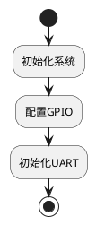

# ncdocgen 用户手册

## 目录

1. [简介](#简介)
2. [安装与启动](#安装与启动)
3. [界面说明](#界面说明)
4. [使用流程](#使用流程)
5. [高级功能](#高级功能)
6. [注意事项](#注意事项)
7. [故障排除](#故障排除)

## 简介

ncdocgen 是一个C语言文档生成器，可以根据代码中的 doxygen 风格注释自动生成详细设计文档，包含：

- 📄 **函数说明表**：原型、概述、参数、返回值、全局变量等
- 📊 **PlantUML流程图**：自动绘制函数逻辑流程图
- 📝 **Markdown格式**：可直接用于文档发布

### 适用场景

- 嵌入式C项目详细设计文档编写
- 代码审查和文档同步
- 项目交接和维护文档生成

## 安装与启动

### 系统要求

- **操作系统**: Windows 10/11
- **内存**: 至少 512MB 可用内存
- **磁盘空间**: 至少 100MB 可用空间

### 安装步骤

1. 从发布页面下载 `ncdocgen.exe`
2. 将文件复制到任意目录（建议放在项目目录下）
3. 双击运行即可

> **注意**: 首次运行会自动创建 `log/` 目录存放日志文件。

### 启动方式

- **GUI模式**: 直接双击 `ncdocgen.exe`
- **命令行模式**: `ncdocgen.exe --cli [参数]`

## 界面说明


### 区域说明

| 区域 | 说明 |
|------|------|
| **📂 输入文件** | 选择要分析的C源文件（可多选，用分号分隔） |
| **💾 输出文件** | 指定生成的Markdown文件路径 |
| **📁 项目路径** | 选择项目根目录（用于扫描生成Key.txt） |
| **🔑 key.txt文件** | 关键字定义文件路径 |
| **选项** | 流程图深度、详细日志、PUML URL嵌入等选项 |
| **执行日志** | 显示操作日志和错误信息 |
| **状态栏** | 显示当前操作状态 |

### 按钮说明

| 按钮 | 功能 |
|------|------|
| **浏览...** | 打开文件/目录选择对话框 |
| **➕生成Key** | 首次使用，扫描项目生成Key.txt |
| **🔄更新Key** | 已有Key.txt，重新扫描更新 |
| **🚀 开始生成文档** | 执行文档生成（需满足三个条件） |

## 使用流程

### 首次使用流程

```
1. 启动程序
   ↓
2. 选择"📂 输入文件"（选择要分析的.c文件）
   ↓
3. 选择"📁 项目路径"（选择项目根目录）
   ↓
4. 点击"➕生成Key"按钮
   等待扫描完成...
   ↓
5. 点击"🚀 开始生成文档"
   等待生成完成...
   ↓
6. 查看生成的 output.md 文件
```

### 日常使用流程

```
1. 启动程序
   ↓
2. 选择"📂 输入文件"
   ↓
3. （可选）更新Key.txt
   ↓
4. 点击"🚀 开始生成文档"
   ↓
5. 查看生成的文档
```

### 详细步骤说明

#### 1. 选择输入文件

- 点击"浏览..."按钮
- 在弹出的对话框中选择C源文件（可多选）
- 支持 `.c` 和 `.h` 文件
- 多个文件用分号分隔显示

#### 2. 配置输出文件

- 默认输出到程序所在目录的 `output.md`
- 可点击"浏览..."修改保存位置
- 支持自定义文件名

#### 3. 生成/更新 Key.txt

**首次使用：**
- 选择"📁 项目路径"（项目根目录）
- 点击"➕生成Key"
- 等待扫描完成（显示找到多少个符号）

**后续使用：**
- 如需更新关键字，点击"🔄更新Key"

**Key.txt 说明：**
- 包含项目中的宏定义、结构体、枚举等关键字
- 用于区分用户标识符和系统关键字
- 生成在程序所在目录

#### 4. 配置选项

| 选项 | 说明 |
|------|------|
| **流程图深度** | 控制流程图展开的最大深度（默认10） |
| **详细日志** | 勾选后显示DEBUG级别的详细日志 |
| **嵌入PUML URL** | 将流程图转换为在线URL嵌入（不需要本地渲染） |

#### 5. 生成文档

- 确认所有必填项已填写
- "🚀 开始生成文档"按钮变为可用状态
- 点击按钮开始生成
- 查看日志区域的状态更新
- 生成完成后自动打开文件夹并选中输出文件

## 高级功能

### 命令行模式

```bash
# 基本用法
ncdocgen.exe --cli code.c -o output.md

# 多文件
ncdocgen.exe --cli file1.c file2.c -o out.md

# 指定Key.txt
ncdocgen.exe --cli *.c -k Key.txt -v

# 只更新Key.txt
ncdocgen.exe --cli --update-key --project-path ./src

# 帮助
ncdocgen.exe --cli --help
```

### 命令行参数

| 参数 | 说明 |
|------|------|
| `--cli` | 使用命令行模式 |
| `-o, --output` | 输出文件路径 |
| `-k, --keyword` | Key.txt文件路径 |
| `-d, --depth` | 流程图深度 |
| `-v, --verbose` | 详细输出 |
| `-e, --embedded` | 嵌入PUML URL |
| `-u, --update-key` | 更新Key.txt |
| `--project-path` | 项目路径 |

### 流程图注释规范

程序会提取 `/** */` 格式的注释作为流程图说明：

```c
/** 初始化系统 */
void init_system(void)
{
    /** 配置GPIO */
    gpio_init();
    
    /** 初始化UART */
    uart_init();
}
```

生成的流程图：


## 注意事项

### 文件编码

- 支持 UTF-8 和 GBK 编码的源文件
- 建议统一使用 UTF-8 编码

### 注释格式

- **流程图注释**: `/** 说明文字 */`（会被提取到流程图）
- **普通注释**: `/* 说明文字 */` 或 `// 说明文字`（不会被提取）

### Key.txt 格式

```
# 这是注释
# 格式: 关键字=类型

# 宏定义
MAX_SIZE=AUTO
MIN_SIZE=AUTO

# 结构体
MyStruct=AUTO
```

### 日志文件

- 存放在程序目录下的 `log/` 文件夹
- 按时间命名，如 `20260403_143022.log`
- 可用于故障排查

## 故障排除

### 常见问题

#### 1. "开始生成文档"按钮不可用

**原因**: 需要同时满足三个条件：
- 输入文件已选择
- 输出文件已指定
- Key.txt 已指定（或已成功生成）

**解决**: 检查以上三项是否都已填写

#### 2. 生成失败，提示语法错误

**原因**: 源文件存在C语法错误

**解决**: 
- 检查源文件是否能正常编译
- 确保头文件路径正确

#### 3. Key.txt 生成失败

**原因**: 
- 项目路径不存在
- 未找到ctags工具

**解决**:
- 检查项目路径是否正确
- 确保 `ctags/` 目录存在于程序目录

#### 4. 流程图显示不正确

**原因**: 
- 流程图深度设置过小
- 复杂的嵌套结构

**解决**:
- 增大"流程图深度"选项
- 简化代码逻辑

### 获取帮助

1. 查看日志文件 `log/*.log`
2. 勾选"详细日志"选项重新运行
3. 联系技术支持

---

**文档版本**: v1.0  
**更新日期**: 2026-04-03
